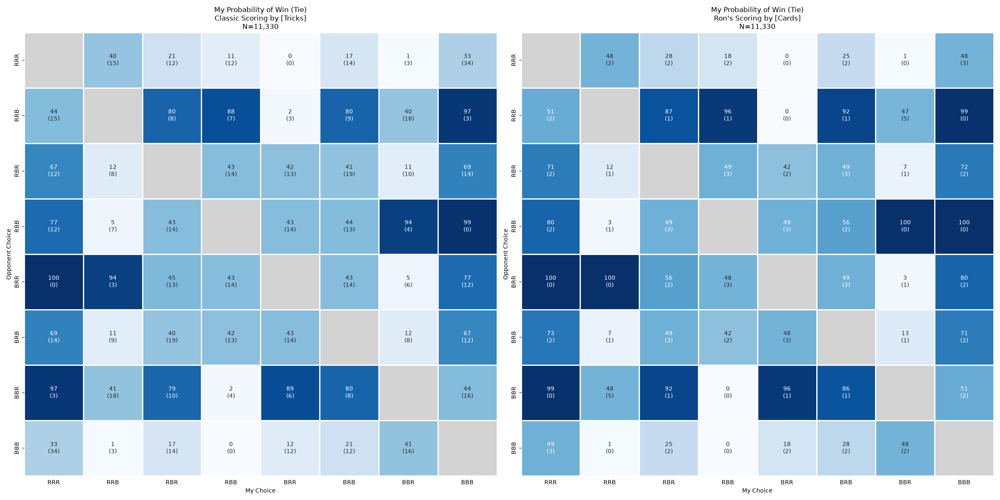

# Penney's Game Simulation

## Introduction

DATA 440 - Automation & Workflow

- Emmanuel Opoku
- Mark Serena

This project simulates and visualizes results from two versions of the Humble-Nishiyama (H-N) Randomness Game, a variation of Penney's Game that uses a standard 52-card deck of playing cards.

## Penney's Game

[Penney's Game](https://en.wikipedia.org/wiki/Penney%27s_game) is a non-transitive game involving competing sequences of coin flips. Each player selects a sequence of three outcomes, such as HHT or THH. A coin is then repeatedly flipped until one player's sequence appears. The player whose sequence appears first wins.

An important feature of Penney's Game is that the relationships between sequences are non-transitive: there is no single sequence that is optimal against every other sequence.

## H-N Game

The Humble-Nishiyama (H-N) Randomness Game replaces the coin flips of Penney's Game with the red and black cards of a standard 52-card deck. Each player selects a three-card sequence of red (R) and black (B), such as RRB or BRR.

Cards are drawn from a shuffled deck and added to a pile. When the most recently drawn three cards match one of the players' selected sequences, that player wins the pile. The pile is then cleared and play continues through the remainder of the deck.

This project investigates two methods of scoring the H-N Game.

### Classic Scoring

In the classic H-N Game, scoring is based on "tricks." A player receives one point each time their sequence wins a pile, regardless of the number of cards in that pile.

### Ron's Scoring

Ron's variation scores the game according to the total number of cards won by each player rather than the number of piles won.

## Purpose of the Investigation

Given each possible opponent choice, which sequence provides the strongest response, and does that strategy change when scoring by tricks versus total cards won?

## Running the Simulation

The program is organized as a data-processing pipeline. `main.py` serves as
the entry point and coordinates the generation of simulated decks, processing
of the game results, and creation of the heatmap visualizations.

The primary source files are located in the `src` directory. Simulation data
are stored under `data`, and generated visualizations are stored in `figures`.
Previous versions of the visualizations are retained in `figures/archive`.

To run the program from the root directory of the repository enter the command: 
uv run main.py

When the program starts, the user is prompted to choose whether to start a
new simulation, add additional simulated decks to the existing data, or use
the existing simulation data.

Each simulation consists of a uniquely randomized shuffle of a standard 52-card deck. 
For each shuffled deck, every possible pairing of the eight three-card color 
patterns is played against the same deck. Using the same set of shuffled 
decks for all pattern pairings allows the results of the different strategies 
to be compared under identical simulated conditions.

If starting a new simulation or adding to an existing simulation, the user
will also be prompted for the number of decks to generate. The simulation
results are processed and heatmaps for both scoring methods are generated
automatically.

## Results

Results are presented as heatmaps, one for each variation of the game. 
The value in each cell represents the percentage of games won by "My Choice" 
against the corresponding "Opponent Choice." The value in parentheses represents 
the percentage of games that resulted in a tie.

## Optimal Strategies

The primary strategy is to avoid being the first player to select a color
pattern. Because the game is non-transitive, there is no single pattern that
is optimal against every other pattern. Instead, the second player should
select the pattern that best counters the first player's choice.

The simulations show that the optimal counter depends not only on the
opponent's selection, but in some cases also on the scoring method. 

For example, when the opponent selects RRR, RRB provides the highest win
percentage under Classic scoring, while BBB provides the highest win
percentage under Ron's scoring. A similar difference occurs when the
opponent selects BBB.

Therefore, while both versions favor selecting a pattern in response to the
opponent's choice, the optimal response is not always consistent between the
two scoring methods.

